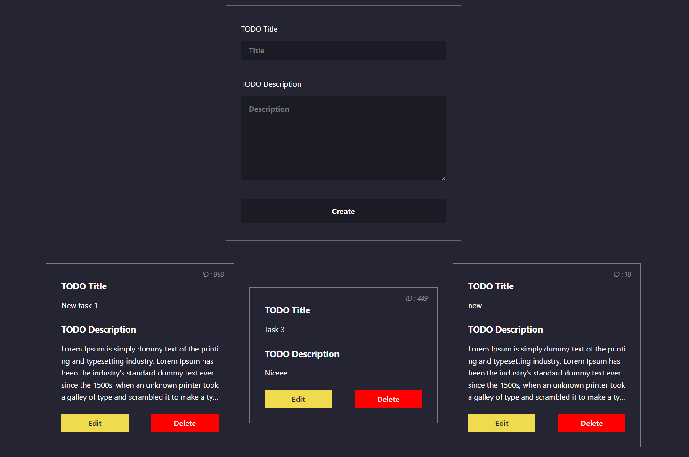
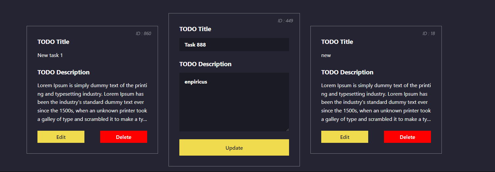
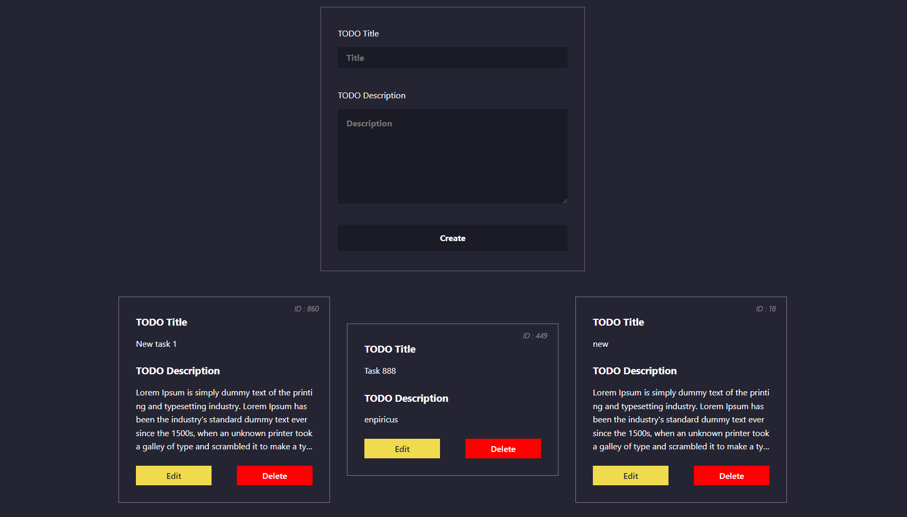

# React TODO

 ***REACT TODO V1 ---> (useState + localStorage)***\
 ***REACT TODO V2 ---> (useState + localStorage + useContext) (starting from the 4th commit)*** 

 **Previews :**
1.
 \
 2.
 \
 3.
 
